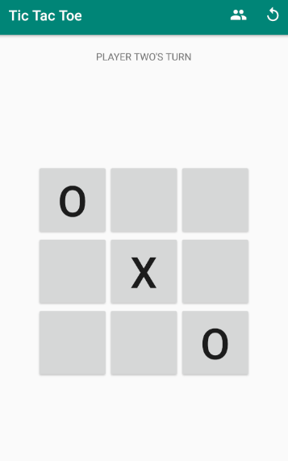
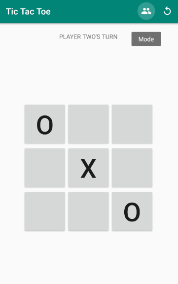
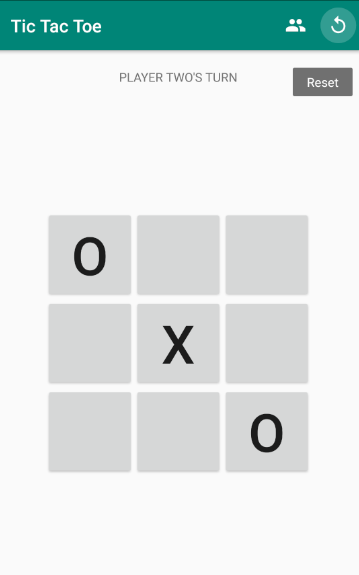
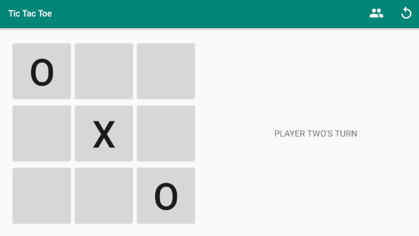
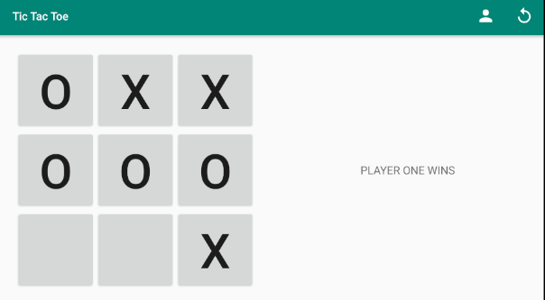

# NAS19-TicTacToe

Tic Tac Toe Android app created in Android Studio. Allows for two or one player games.

## Portrait mode

## Switch gamemodes, reset game menu buttons.

## Landscape mode, game setup is saved in Bundle

## Singleplayer mode

